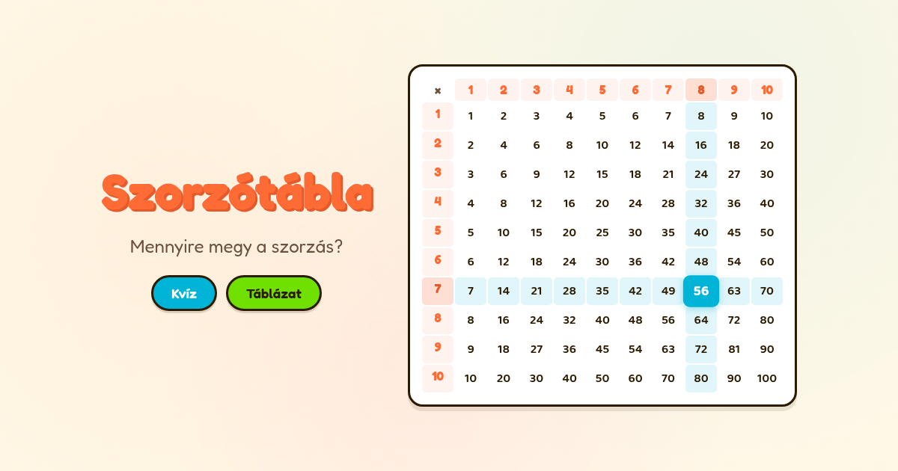

# ✖️ Szorzótábla

A fun multiplication and division quiz game for kids. Pick a mode, enter your name, and go!

**[▶ Play now!](https://static.kissgyorgy.me/szorzotabla/)**



## Features

- **Three game modes** — Multiplication only, Division only, or Mixed (both)
- **Player profiles** — Saves multiple player names, easy to switch between them
- **Leaderboard** — Top 10 times per mode, stored in localStorage
- **Interactive reference table** — Multiplication and division tables in grid and grouped views
- **Instant feedback** — Shake animation on wrong answers, green flash on correct ones
- **Confetti 🎊** — Fires on a top-3 finish
- **Mobile-friendly** — Large touch targets, automatic numeric keyboard

## Tech stack

- [React 19](https://react.dev/) + [TypeScript](https://www.typescriptlang.org/)
- [Vite](https://vitejs.dev/) — build tool and dev server
- [canvas-confetti](https://github.com/catdad/canvas-confetti) — celebrations
- Google Fonts: [Fredoka](https://fonts.google.com/specimen/Fredoka) + [Baloo 2](https://fonts.google.com/specimen/Baloo+2)
- No backend — all data stored in `localStorage`

## Development

```bash
npm install
npm run dev      # dev server → http://localhost:5173
npm run build    # TypeScript check + Vite production build → dist/
```

## License

[MIT](LICENSE)
